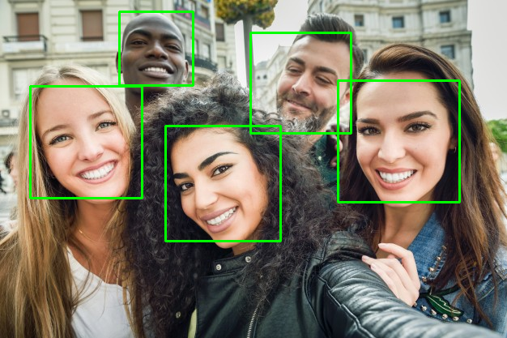

## Face detection (Image)

  

In this project was developed a program to detect face in images using Viola-Jones/Haar cascade algorithm. 

## Usage

1. Fill the path configuration variables `preTrainedFaceDetectorPath` and `imagePath` in main.py
2. Run `python main.py`

